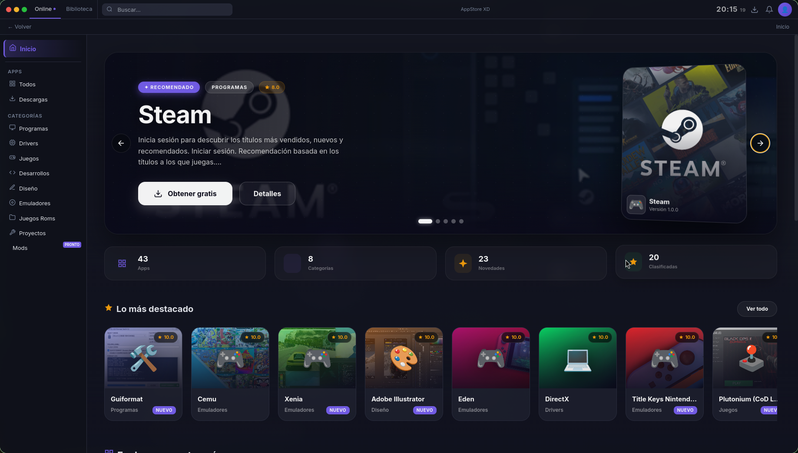
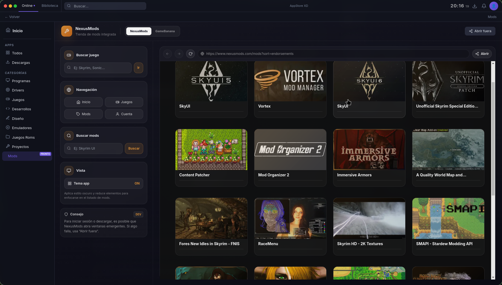
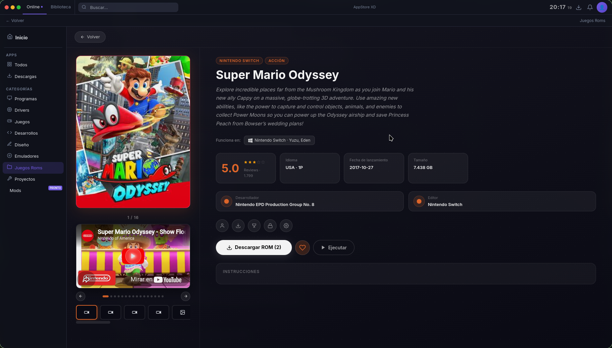
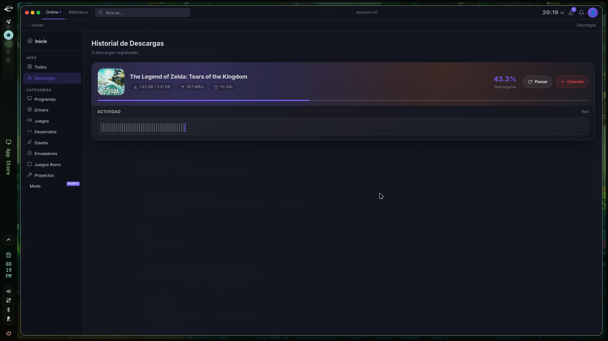

# 🚀 UnknownGestor - App Store & Mod Manager


**UnknownGestor** es una potente tienda de aplicaciones y gestor de mods multiplataforma (Linux y Windows) diseñada para ofrecer una experiencia fluida y elegante al descargar software, juegos y personalizaciones.

---

## ✨ Características Principales

### 📦 Tienda de Aplicaciones
- **Descargas Directas:** Instalación simplificada de programas esenciales y juegos.
- **Categorización Inteligente:** Navega entre Drivers, Juegos, Diseño, Desarrollo y más.
- **Multi-Fuente:** Soporte para múltiples repositorios JSON externos.

### 🎮 Gestor de Roms y Emuladores
- **Lanzador Integrado:** Ejecuta tus juegos retro directamente desde la aplicación.
- **Biblioteca Personal:** Guarda tus juegos favoritos para un acceso rápido.
- **Resolución de Enlaces:** Soporte para 1fichier, Mediafire y más.


### 🛠️ Integración de Mods (NexusMods & GameBanana)
- **Navegación Fluida:** Explora las mayores comunidades de modding sin salir de la app.
- **Búsqueda Avanzada:** Encuentra juegos y mods específicos con buscadores dedicados.

### ⚡ Potencia Técnica
- **Motor WebTorrent:** Soporte nativo para descargas de torrents.
- **Interfaz Moderna:** Diseño "Glassmorphism" con temas oscuros y animaciones suaves.
- **Multiplataforma:** Compilado nativamente para Linux (AppImage/Deb) y Windows (Portable/Instalador).

---

## 📸 Capturas de Pantalla

| Inicio | Explorador de Mods |
| :---: | :---: |
|  |  |

| Biblioteca de Juegos | Gestor de Descargas |
| :---: | :---: |
|  |  |

---

## 🚀 Instalación y Uso

### Descargar Binarios
Puedes descargar la última versión estable desde la sección de [Releases](https://github.com/Solaez/UnknownGestor/releases).

#### **Linux**
1. Descarga el archivo `.AppImage`.
2. Dale permisos de ejecución: `chmod +x UnknownGestor-1.0.0.AppImage`.
3. ¡Ejecuta y disfruta!

#### **Windows**
1. Descarga el instalador `.exe` o la versión portable.
2. Ejecuta el archivo.

---

## 🛠️ Desarrollo (Para Contribuidores)

Si deseas clonar el repositorio y compilarlo tú mismo:

1. **Clonar el repo:**
   ```bash
   git clone https://github.com/Solaez/UnknownGestor.git
   cd UnknownGestor
   npm install
   npm start
